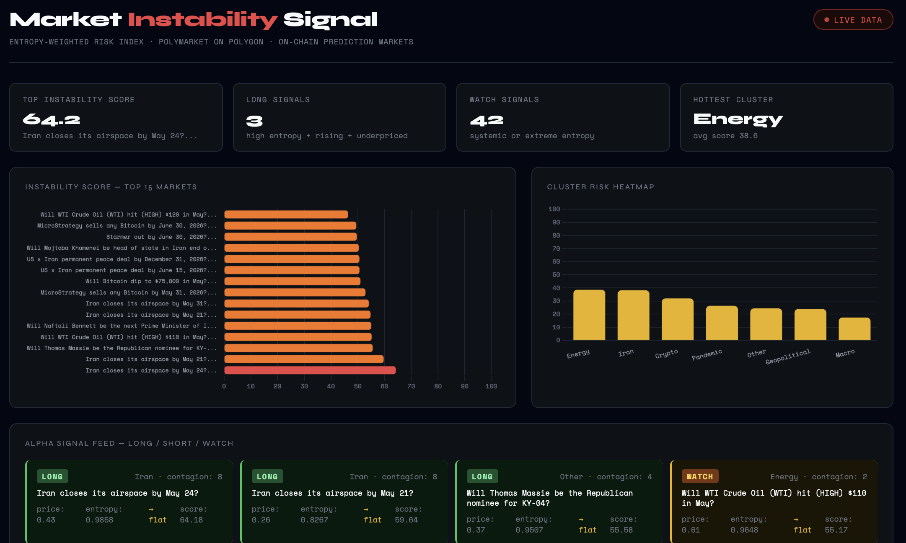

# Market Instability Signal

A real-time instability detection dashboard powered by on-chain prediction market data 
from Polymarket (Polygon blockchain). 


## The Idea

Prediction markets price real-world uncertainty with money on the line — a harder, 
more honest signal than sentiment analysis or surveys. Unlike sentiment indices, every 
Polymarket price is a cryptographically-settled, on-chain bet in USDC on Polygon PoS. 
People don't just say what they think — they stake capital on it.

This project treats those prices as a **decentralized uncertainty oracle** and applies 
entropy-based scoring inspired by econophysics to detect which macro, geopolitical, and 
financial markets are in the most unstable regime right now.

The core insight: a prediction market at 50/50 with spiking volume and thin liquidity 
is a system at maximum disorder. That's not a coincidence — it's a measurable regime 
state, the same way physicists detect phase transitions in complex systems.

## Instability Score

Each market is scored 0–100 using four signals:

| Signal | Weight | Logic |
|--------|--------|-------|
| Shannon Entropy | 35% | Max at price=0.5 — maximum disorder in the system |
| Entropy Velocity | 25% | Rate of change — is instability accelerating? |
| Liquidity Fragility | 25% | Low USDC depth = fragile market = easier to move |
| Volume Acceleration | 15% | Is crowd participation growing relative to baseline? |

### Why Liquidity Fragility?

A market with $500 in liquidity and 50/50 pricing is fundamentally different from one 
with $500,000 at the same price. The first can be moved by a single trader — it's 
structurally fragile. Fragility amplifies instability: high entropy in a thin market 
is a stronger signal than the same entropy in a deep one.

Fragility score = `1 / (1 + liquidity / 5000)` — approaches 1 as liquidity → 0, 
approaches 0 as liquidity → ∞.

## Alpha Signals

| Signal | Condition | Interpretation |
|--------|-----------|----------------|
| LONG | Entropy > 0.75 + flat/rising + price < 0.55 + volume accelerating | Crowd uncertain, underpricing YES — potential upside |
| SHORT | Entropy falling + price > 0.65 + entropy < 0.8 | Market resolving toward YES — uncertainty fading |
| WATCH | Cluster contagion ≥ 4 OR entropy > 0.9 | Systemic or extreme instability |
| NEUTRAL | Everything else | No directional signal |

## Cluster Contagion

Markets are grouped into thematic clusters: Iran, Crypto, Energy, Macro, Geopolitical, 
Pandemic. When 4+ markets in the same cluster spike in entropy simultaneously, a 
contagion flag is triggered.

This is the key econophysics insight: one uncertain market is noise. Four correlated 
markets uncertain at the same time is a **cascade** — the signature of systemic 
instability propagating through a network. The same pattern appears in financial 
contagion, epidemic spreading, and phase transitions in physical systems.

## The Blockchain Layer

Every price is the result of thousands of EIP-712 signed transactions settled 
atomically on Polygon via Polymarket's hybrid CLOB. Reading via the Gamma + CLOB 
APIs means reading trustless, manipulation-resistant crowd-priced probabilities — 
not a survey, not a sentiment score, not an editorial judgment.

Polymarket runs on Polygon PoS (Chain ID 137): ~110 TPS, ~$0.002 avg tx cost. 
All settlement is non-custodial and on-chain in USDC.

## Research Hypothesis

*Does Shannon entropy computed over on-chain prediction market prices lead traditional 
financial volatility measures?*

If crowd-priced uncertainty (entropy index) systematically precedes realized volatility 
in correlated assets — oil futures when the Energy cluster spikes, crypto realized vol 
when the Crypto cluster spikes — then this index functions as a **decentralized early 
warning system for regime change**.

This is testable: compute the entropy index at time T, check if VIX or crypto realized 
volatility spikes at T+1 or T+2. If the signal leads, it's alpha. Nobody has formally 
published this with Polymarket data — the dataset is new enough that the research 
hasn't been done yet.

## Stack

- Python — data pipeline
- Polymarket Gamma API — market discovery, metadata, liquidity (no auth)
- Polymarket CLOB API — price history (no auth)
- Chart.js — interactive dashboard
- Polygon PoS — on-chain settlement layer

## Run It

```bash
pip install -r requirements.txt
python main.py        # fetches + scores 200 markets (~15 seconds)
python dashboard.py   # builds dashboard.html + opens in browser
```

## Scoring Formula
instability = (entropy × 0.35) + (entropy_velocity × 0.25) +
(liquidity_fragility × 0.25) + (volume_acceleration × 0.15)

## Extensions

- **Hurst exponent** per market — detect trending vs mean-reverting regimes
- **Autocorrelation collapse** — leading indicator of regime transition  
- **Cross-cluster cascade scoring** — did instability start in Iran then spread to Energy?
- **Backtest** — entropy index at T vs VIX/realized vol at T+1
- **WebSocket feed** — real-time entropy updates via Polymarket's CLOB WebSocket
